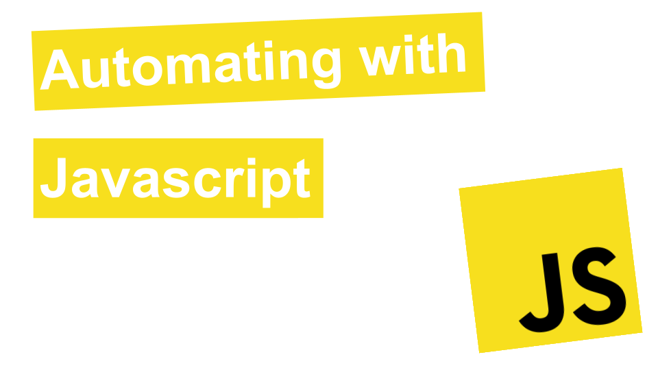

# Automating with Javascript

- Automate common tasks with Javascript such as:

  - Editing Text Files
  - Navigating and Searching for Files
  - Renaming Files
  - Downloading Files
  - Watermarking Images
  - Modifying PDFs
  - Modifying CSVs and Excel Files
  - Sending emails
  - Webscraping
  - Working with APIs
  - Desktop / GUI Automation
  - Selenium

- Course: https://www.youtube.com/playlist?list=PLn2ipk-jqgZj_TW-epRe3YBTmSmc9evAu

- Each task / project that is automated has its own corresponding video that you can follow along with.

## Prerequisites

- [Node.js/npm](https://nodejs.org/en/)
